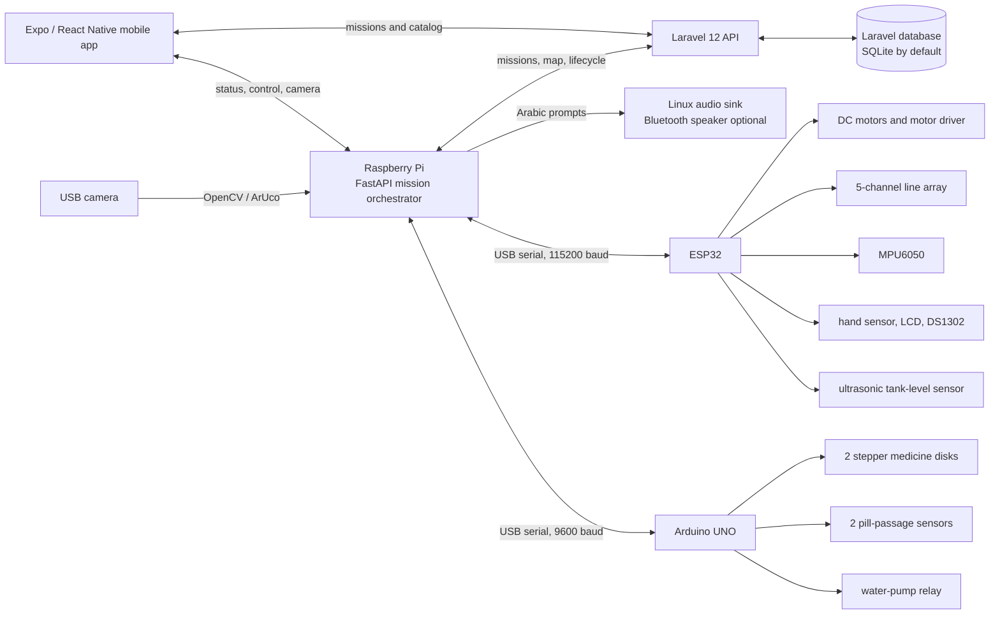
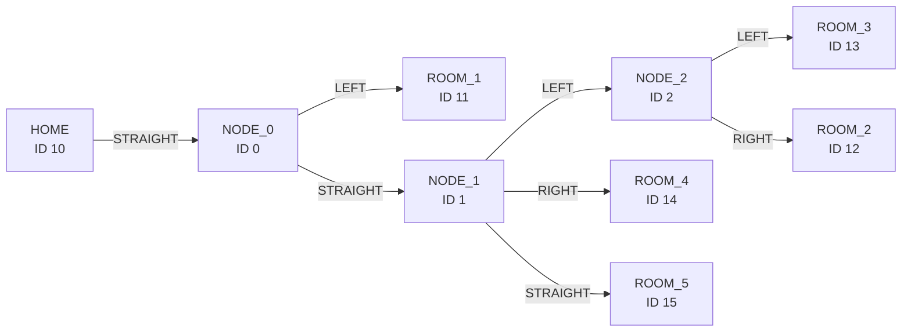
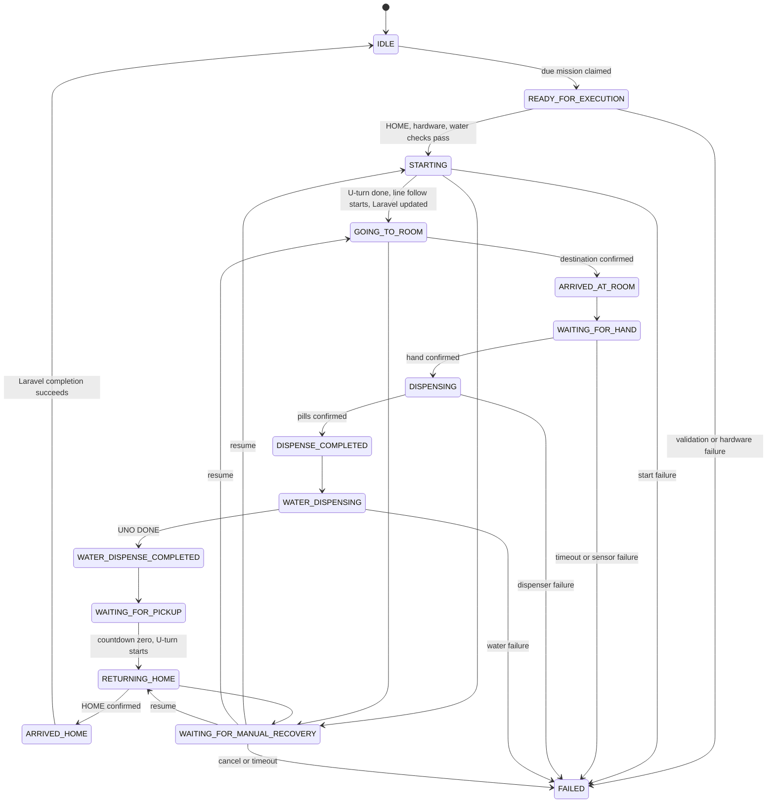

# Autonomous Medicine Dispensing Robot

An autonomous mobile-robot prototype that transports medicine and water from a HOME station to one of five predefined rooms, guides the recipient through pickup, and returns to HOME. The system combines embedded control, computer vision, a web API, and a mobile application in a distributed three-controller architecture.

> [!IMPORTANT]
> This is an educational graduation-project prototype. It is not a certified medical device and must not be used for clinical medication administration.

## 1. Project Overview

The project explores how a small indoor robot can automate a repeatable delivery workflow while keeping navigation, dispensing, and user interaction independently testable. A mission is created or scheduled through the mobile application and stored by Laravel. The Raspberry Pi claims the mission, confirms that the robot is physically at HOME, coordinates the journey, and records completion.

```text
HOME confirmation -> outbound navigation -> room confirmation -> hand detection
-> medicine dispensing -> timed water delivery -> 30-second pickup window
-> return navigation -> HOME confirmation -> mission completion
```

The Raspberry Pi makes mission and route decisions. The ESP32 executes real-time movement and sensing. The Arduino UNO controls the two medicine disks and the automated mission water pump.

## 2. Key Features

- Autonomous black-line navigation using a five-channel active-low sensor array.
- Five destinations with directed outbound routes, explicit return routes, and a dedicated HOME node.
- OpenCV ArUco localization using `DICT_4X4_50`, three-frame confirmation, minimum-area filtering, dominant-marker selection, and expected-marker checking.
- Bounded intersection maneuvers, sensor-guided U-turns, automatic line-loss recovery, and timed manual recovery when autonomous recovery fails.
- Two independently calibrated eight-slot medicine disks, each with a stepper motor and pill-passage sensor.
- Multi-medicine missions mapped to dispenser boxes 1 and 2.
- Hand-gated delivery, 20x4 LCD status, and a 30-second pickup countdown.
- Ultrasonic tank-level checks and a 4.5-second automated water-delivery cycle.
- DS1302 RTC scheduling with `Asia/Hebron` timezone handling in software.
- Optional offline Arabic voice guidance from the Raspberry Pi.
- Expo mobile mission, manual-control, calibration, water-status, and live-camera interfaces.
- FastAPI hardware diagnostics plus Laravel mission, room, medicine, and physical-map APIs.

## 3. System Architecture



The Raspberry Pi is the only component that combines mission context, camera evidence, and the Laravel map. Embedded controllers expose bounded commands and machine-readable acknowledgements; they do not choose destinations or update mission records.

## 4. Hardware Architecture

Only components identifiable from current source and configuration are listed. Exact board revisions, power ratings, battery specifications, and mechanical dimensions are not recorded in the repository.

| Component | Quantity | Purpose | Controller / interface |
| --- | ---: | --- | --- |
| Raspberry Pi | 1 | Mission orchestration, APIs, vision, audio, and controller coordination | Linux, USB, network |
| ESP32 development board | 1 | Locomotion, navigation sensing, RTC, LCD, hand and water-level sensing | USB serial at 115200 baud |
| Arduino UNO | 1 | Medicine mechanisms and automated water-pump relay | USB serial at 9600 baud |
| Geared DC drive motors | 2 | Differential-drive locomotion | ESP32 through a dual motor-driver interface |
| Five-channel IR line array | 1 | Line position, intersections, and line loss | ESP32 GPIO |
| MPU6050 | 1 | Heading feedback for turns and recovery | ESP32 I2C |
| USB camera | 1 | ArUco localization and MJPEG preview | Raspberry Pi `/dev/video0` by default |
| 2048-step geared stepper motors | 2 | Rotate medicine disks by one slot | Arduino UNO via ULN2003-style wiring |
| Eight-slot medicine disks | 2 | Hold two configured medicine types | Mechanically indexed by the UNO |
| Pill-passage IR sensors | 2 | Confirm passage through each chute | Arduino UNO interrupt-capable inputs |
| Water pump and active-low relay | 1 each | Timed mission water delivery | Arduino UNO D2 |
| Ultrasonic level sensor | 1 | Classify tank level | ESP32 trigger/echo GPIO |
| Hand-detection IR sensor | 1 | Gate dispensing on recipient presence | ESP32 GPIO with debounce |
| 20x4 LCD | 1 | Prompts, status, and pickup countdown | ESP32 I2C |
| DS1302 RTC module | 1 | Local scheduling wall clock | ESP32 three-wire interface |
| Audio output / speaker | 1 | Optional Arabic guidance | Raspberry Pi default Linux audio sink |

## 5. Controller Responsibilities

### Raspberry Pi

- Runs FastAPI and owns both USB serial connections.
- Claims due missions from Laravel and maintains the mission state machine.
- Loads Laravel's map and computes outbound and return decisions.
- Owns the USB camera, validates ArUco observations, and serves MJPEG preview.
- Checks HOME readiness, dispatches navigation, and verifies expected markers.
- Coordinates hand, medicine, water, pickup, return, and Laravel updates.
- Produces optional Arabic prompts using WAV files or offline eSpeak NG. Bluetooth pairing is an operating-system concern.

### ESP32

- Drives the two-motor differential base and manual movement.
- Runs line following, intersection maneuvers, U-turns, and bounded line-loss recovery.
- Uses the MPU6050 for turn and recovery heading feedback.
- Reads the hand sensor, tank-level sensor, and DS1302 RTC.
- Renders mission prompts and pickup time on the LCD.
- Reports intersection, U-turn, recovery, and line-loss events.

### Arduino UNO

- Drives two eight-slot medicine-disk stepper motors.
- Starts uncalibrated; the operator aligns each disk to physical Slot 0 and sends `SET_SLOT_ZERO_1` or `SET_SLOT_ZERO_2`.
- Confirms every requested pill with its matching chute sensor.
- Controls the active-low mission water-pump relay on D2 and reports start and completion.

The ESP32 firmware retains separate maintenance pump commands, but automated missions send `WATER_DISPENSE|MS=4500` to the Arduino UNO.

## 6. Navigation System

The ESP32 interprets black as `0` and white as `1` across sensors `O1` through `O5`, with `O3` at the center. Proportional corrections keep the array centered. Three readings with at least four black sensors signal an intersection; three all-white readings start bounded recovery.

Recovery brakes, backtracks, searches using gyro-limited headings, tracks line contact, verifies the surface pattern, and locks back onto the route. If it fails, the Raspberry Pi enters `WAITING_FOR_MANUAL_RECOVERY`. An operator has a 15-second default window to reposition and resume; cancellation or timeout fails the mission.

At an intersection, the robot stops and the Raspberry Pi requests a confirmed camera observation. The marker must be approved, dominant, and—after a prior step—the expected next marker. Missing, ambiguous, unexpected, or unmapped evidence never falls back to an arbitrary straight command.

### Current logical map



Outbound paths use breadth-first search over Laravel's directed connections. Return routes are explicit because decisions are heading-aware after the room U-turn:

| From room | Return decisions |
| --- | --- |
| Room 1 | U-turn to NODE_0, RIGHT to HOME |
| Room 2 | U-turn to NODE_2, LEFT to NODE_1, RIGHT to NODE_0, STRAIGHT to HOME |
| Room 3 | U-turn to NODE_2, RIGHT to NODE_1, RIGHT to NODE_0, STRAIGHT to HOME |
| Room 4 | U-turn to NODE_1, LEFT to NODE_0, STRAIGHT to HOME |
| Room 5 | U-turn to NODE_1, STRAIGHT to NODE_0, STRAIGHT to HOME |

HOME and room departures use bounded physical-right, sensor-guided U-turns. The controller must clear the original line and reacquire a valid line before completion. Printable marker assets are in [`aruco_markers/`](aruco_markers/).

## 7. Medicine Dispensing

Each disk has eight equal slots. With 2048 motor steps per revolution, one pill command advances 256 steps. Position is tracked modulo eight, but there is no homing switch or absolute encoder, so both disks require manual Slot 0 alignment after power-up.

For each mission item, the Raspberry Pi verifies calibration and issues one `DISPENSE_1` or `DISPENSE_2` command per requested pill. The UNO returns `ACK`, advances one slot, and waits for the matching sensor pulse. Only confirmed passage produces `DONE`; stuck-sensor and pill-timeout conditions produce an error. The Raspberry Pi compares requested and confirmed totals before advancing.

The sensor confirms passage only. It does not identify a drug, verify dosage, or verify the recipient.

## 8. Water Delivery

The ESP32 converts ultrasonic distance into `OK`, `LOW`, `EMPTY`, or `SENSOR_ERROR`. Empty and sensor-error results block mission startup and delivery; low level remains permitted.

After medicine succeeds, the Raspberry Pi sends `WATER_DISPENSE|MS=4500` to the UNO. The UNO validates the 100–60,000 ms range, activates the D2 relay without blocking serial input, turns it off, and returns matching `ACK` and `DONE` responses. This is timed delivery with no flow-meter feedback.

A separate calibrated-volume development endpoint remains disabled while `WATER_FLOW_ML_PER_SECOND=0`; it also converts volume to time rather than measuring flow.

## 9. Human Interaction

At a confirmed room, the LCD asks the recipient to place a hand under the dispenser. The Raspberry Pi waits for the ESP32's debounced signal before allowing medicine. The LCD then reports medicine and water progress, followed by a 30-second pickup countdown before return.

With `VOICE_ENABLED=true`, the Raspberry Pi plays Arabic prompts for mission start, arrival, hand placement/detection, dispensing, completion, return, HOME arrival, recovery, and failure. Playback uses one queue; audio failure does not change mission state.

## 10. Mission Lifecycle



`ARRIVED_HOME` remains observable briefly before Laravel is updated and the executor returns to `IDLE`.

## 11. Software Stack

| Area | Current stack |
| --- | --- |
| Raspberry Pi | Python, FastAPI, Pydantic, pySerial, HTTPX |
| Computer vision | OpenCV Contrib, ArUco `DICT_4X4_50` |
| Backend | PHP 8.2+, Laravel 12, Eloquent; SQLite by default |
| Mobile | TypeScript, React Native 0.81, Expo SDK 54, Expo Router, Axios |
| ESP32 | C++, Arduino framework, PlatformIO, MPU6050, hd44780, DS1302 |
| Arduino UNO | Arduino C++, `Stepper`, AVR pin-change interrupts |
| Tests | pytest, PHPUnit, custom TypeScript/Node test runner |

## 12. Repository Structure

```text
.
├── raspberry_controller/   # FastAPI, serial, missions, vision and routing
├── esp32_controller/       # PlatformIO locomotion, sensors, LCD and RTC firmware
├── arduino_controller/     # UNO medicine and mission-water firmware
├── hardwareLaravel/        # Laravel mission, inventory and map API
├── HardReactNative/
│   └── medicine-robot-new/ # Expo mobile application
├── aruco_markers/          # Printable HOME, intersection and room markers
└── tests/                  # Raspberry, protocol and navigation tests
```

`esp32_controller/backup_old_chair_code/` and excluded chair/Wi-Fi/MQTT sources are historical, not part of the PlatformIO build. Raspberry Pi `hospital.db` and older local mission services remain compatibility code; Laravel is the current mission source of truth.

## 13. Communication

| Link | Purpose | Interface |
| --- | --- | --- |
| Mobile ↔ Laravel | Catalog and mission lifecycle | HTTP/JSON |
| Mobile ↔ Raspberry Pi | Status, control, calibration and camera | HTTP/JSON, MJPEG |
| Raspberry Pi ↔ Laravel | Claim/start/complete missions and fetch map | HTTP/JSON |
| Raspberry Pi ↔ ESP32 | Motion, navigation, sensing, LCD, RTC | USB serial, 115200 baud |
| Raspberry Pi ↔ Arduino UNO | Disk state, pills and mission water | USB serial, 9600 baud |
| Raspberry Pi ↔ USB camera | Frames and preview | Video4Linux |
| Raspberry Pi → speaker | Arabic prompts | Linux default audio sink |

All network addresses are deployment settings. Do not commit local addresses or credentials.

## 14. Setup / Development

### Raspberry Pi Controller

```bash
python -m pip install -r raspberry_controller/requirements.txt
python -m uvicorn raspberry_controller.api:app --host 0.0.0.0 --port 8000 --workers 1
```

Use one worker without `--reload` on hardware because serial, scheduler, camera, and executor state are process-local.

Important optional variables: `ESP32_PORT`, `ARDUINO_PORT`, `ESP32_STARTUP_DELAY`, `ARDUINO_STARTUP_DELAY`, `READ_TIMEOUT`, `LARAVEL_API_URL`, `LARAVEL_API_TIMEOUT_SECONDS`, `ROBOT_TIMEZONE`, `MISSION_SCHEDULER_ENABLED`, `MISSION_SCHEDULER_INTERVAL_SECONDS`, `MISSION_AUTO_EXECUTION_ENABLED`, `NAVIGATION_AUTO_ENABLED`, `CAMERA_ENABLED`, `CAMERA_DEVICE`, `CAMERA_WIDTH`, `CAMERA_HEIGHT`, `ARUCO_CONFIRM_FRAMES`, `ARUCO_MIN_MARKER_AREA`, `ARUCO_MIN_AREA_RATIO`, `ARRIVED_HOME_OBSERVATION_SECONDS`, `HAND_WAIT_TIMEOUT_SECONDS`, `VOICE_ENABLED`, `VOICE_LANGUAGE`, `VOICE_AUDIO_DIR`, `VOICE_PLAYBACK_TIMEOUT_SECONDS`, `VOICE_BLOCKING_TIMEOUT_SECONDS`, and `WATER_FLOW_ML_PER_SECOND`.

### Laravel Backend

```bash
cd hardwareLaravel
composer run setup
composer run dev
```

The committed `setup` script installs dependencies, creates `.env` when needed, generates the application key, migrates, and builds assets. The example uses SQLite. Configure `ROBOT_API_URL`, `ROBOT_API_CONNECT_TIMEOUT`, `ROBOT_API_TIMEOUT`, `ROBOT_TIMEZONE`, and `MISSION_CLAIM_LEASE_SECONDS`; never commit `.env`.

### React Native Mobile App

```powershell
cd HardReactNative/medicine-robot-new
npm install
Copy-Item .env.example .env
npm start
```

On macOS/Linux use `cp .env.example .env`. Configure only the endpoint placeholders and timezone:

```dotenv
EXPO_PUBLIC_LARAVEL_API_URL=http://YOUR_SERVER_IP:8000/api
EXPO_PUBLIC_ROBOT_API_URL=http://YOUR_ROBOT_IP:8000
EXPO_PUBLIC_ROBOT_TIMEZONE=Asia/Hebron
```

### ESP32 Firmware

PlatformIO defines `esp32dev` and builds only `src/main.cpp`:

```bash
cd esp32_controller
pio run -e esp32dev
```

Upload with PlatformIO after selecting the correct local serial port. Current firmware has no required Wi-Fi or MQTT path.

### Arduino UNO Firmware

Open [`medicine_dispenser_uno.ino`](arduino_controller/medicine_dispenser_uno/medicine_dispenser_uno/medicine_dispenser_uno.ino) in Arduino IDE, select Arduino UNO and the correct port, then use **Verify** before **Upload**. No board-qualified Arduino CLI configuration is committed, so no CLI upload command is prescribed.

## 15. Running the System

1. Inspect wiring, fill the tank, align both disks, and keep the stop/power control accessible.
2. Start Laravel with its migrated database and seeded physical map.
3. Start FastAPI with one worker and the intended serial, camera, scheduler, navigation, and voice settings.
4. Power both embedded controllers; verify controller, camera, water-level, HOME-marker, and stopped-line readiness.
5. Declare Slot 0 for both physically aligned disks through the calibration UI.
6. Start Expo and confirm its Laravel and robot endpoints.
7. Create a mission. Enabled scheduler/auto-execution settings start due work automatically; otherwise use the available tick/start controls.
8. Observe delivery and return. Do not run unattended near edges, stairs, people, or untested obstacles.

FastAPI interactive documentation is at `http://YOUR_ROBOT_IP:8000/docs`.

## 16. Testing

| Area | Command |
| --- | --- |
| Python syntax | `python -m compileall raspberry_controller tests` |
| Raspberry/controller tests | `python -m pytest -q` |
| Mobile tests | `npm test` |
| Mobile type check | `npm run typecheck` |
| Mobile lint | `npm run lint` |
| Laravel tests | `composer test` |
| Laravel frontend build | `npm run build` |
| ESP32 firmware | `pio run -e esp32dev` |
| Arduino UNO | Arduino IDE **Verify** for the UNO sketch |

Release-run results belong in the handoff or commit history, not as permanent success claims in this README.

## 17. Safety and Limitations

- University prototype; not a certified medical device or production hospital system.
- No drug identity, dosage, recipient, ingestion, allergy, or contraindication verification.
- Pill sensors confirm passage only; water delivery is timed with no flow meter.
- Disks lack homing switches/absolute encoders and require manual Slot 0 calibration.
- Navigation is limited to a prepared line/marker map; general obstacle avoidance and free-space localization are not in the active mission path.
- Time/angle bounds exist, but no long-term quantitative reliability or medical-grade fault tolerance is established.
- Raspberry runtime state is process-local; one worker is required and power loss can interrupt a mission.
- Operational APIs do not implement production-grade access control.
- Enclosure, electrical protection, emergency stop, battery supervision, and production sanitation are not specified by the repository.

## 18. Future Improvements

- Wheel encoders and closed-loop speed/distance control.
- Charging dock and battery telemetry.
- Flow sensor and closed-loop water-volume delivery.
- Homing sensors or encoders for both medicine disks.
- Recipient/medicine verification and role-based API authentication.
- Independent emergency-stop, watchdog, and power-fault handling.
- Improved mechanical isolation, enclosure cleanability, and chute reliability.
- Repeatable navigation, dispensing, and endurance measurements.

## 19. Demo & Documentation

**Project demo:** No public demo URL is currently included.

**Graduation project report:** No report file is currently present. When approved for publication, place it under `docs/` and link it here.

Versioned marker print assets are available in [`aruco_markers/`](aruco_markers/).

## 20. Team

**Students**

- Mahmoud Abdul Jabar Ali Yaseen
- Ayham Fuqha

**Supervisor:** Dr. Luai Malhis

An-Najah National University<br>
Faculty of Engineering and Information Technology<br>
Computer Engineering Department<br>
Academic Year 2025/2026

## 21. License

Licensing for this repository has not yet been specified. No license is granted by the absence of a license file.
